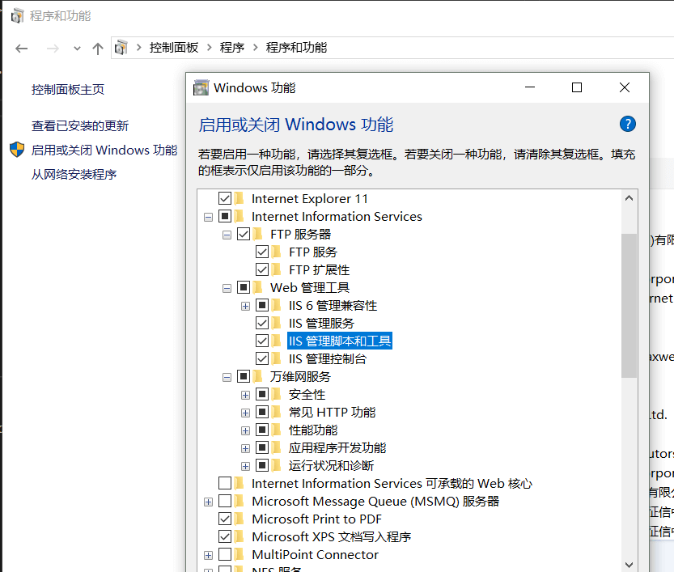

# linux 入门
linux 分为不同发行版本：
> ubuntu redhat centos debain fedora 等

社区：www.linux.org
linux 内核：www.kernal.org
centos: www.centos.org(redhat 的社区版)
redhat: 商业型linux
ubuntu: kylin(中文版的 ubuntu),一年发行两次（lts 为长期支持版）

## 虚拟机
VMware virtual box(开源) virtual PC(微软)

### VMware
官网：www.vwware.comm
mac 安装 fusion产品，window 安装 workstation Pro

### 虚拟机安装linux(ubuntu)
1. vm 新建虚拟机 典型
2. 安装来源 选择 安装程序光盘镜像文件（iso）,选择镜像
3. 内存 2G,处理器数量：1， 每个处理器核心数量：2 

## linux 目录介绍
```
/bin 可执行文件目录(binary)
/boot 系统内核和启动文件
/dev 存放设备文件，如：键盘，鼠标，usb等
/etc 存放系统所有配置文件
/home 用户主目录文件的默认位置
/lib 存放开机时会用到的函数库，以及/bin和/sbin目录下的命令调用的函数库
/media 媒体文件
/mnt 暂时可挂载的设备目录
/usr Unix Software Resource的缩写
/var 软件运行时所产生的文件目录
```

## linux 命令
linux 严格区分大小写
```
ls: 列举 文件
ls -l 显示长格式目录
ls -a 显示所有文件 
  .表示当前目录
  ..表示上一级目录
dir: 列举 文件

cd .. 退回上一级目录
cd ~ 进入当前用户目录 
mkdir aaa 创建 aaa 目录
cp filename director/filename 复制文件名
cp -R filedirector1 filedirector1 复制目录
pwd 显示当前的操作目录
rm filename 删除文件
rm -r filedirector 删除文件夹

```

### linux 下文件操作
1. 复制文件夹

```
命令格式：cp [-adfilprsu] 源文件(source) 目标文件(destination)
参数说明：
-a: 是指archive的意思，也说是指复制所有的目录
-d: 若源文件为连接文件(link file)，则复制连接文件属性而非文件本身
-f: 强制(force)，若有重复或其它疑问时，不会询问用户，而强制复制
-i: 若目标文件(destination)已存在，在覆盖时会先询问是否真的操作
-l: 建立硬连接(hard link)的连接文件，而非复制文件本身
-p: 与文件的属性一起复制，而非使用默认属性
-r: 递归复制，用于目录的复制操作
-s: 复制成符号连接文件(symbolic link)，即“快捷方式”文件
-u: 若目标文件比源文件旧，更新目标文件 
```
2. 移动文件/修改文件名
```
命令格式：mv [-fiv] source destination
参数说明：
-f: force，强制直接移动而不询问
-i: 若目标文件(destination)已经存在，就会询问是否覆盖
-u: 若目标文件已经存在，且源文件比较新，才会更新
```
3. 删除文件
```
命令格式：rm [fir] 文件或目录
参数说明：
-f: 强制删除
-i: 交互模式，在删除前询问用户是否操作
-r: 递归删除，常用在目录的删除
```
4. 文件新建和权限修改
```
touch readme.md 新建文件
chmod 777 readme.md

```

## ssh 登录
> SSH 连接原理: ssh 服务是一个守护进程，系统后台监听客户端的连接; ssh服务端的进程名为sshd,负责实时监听 22端口. ssh 服务端由两部分组成：openssh(提供ssh服务)，openssl(提供加密),连接ssh 的客户端可以使用xshell, securecrt, mobaxterm等工具

### ssh 命令
```
查询 sshd进程：ps -ef | grep ssh
查看端口: netstat -lntup | grep ssh
ssh 服务关闭：service sshd stop
ssh 服务启动：service sshd start
ssh 服务重启：service sshd reload
ssh 远程登录：ssh -p 22 username@服务主机ip; 端口为22时可省略: ssh username@服务主机ip
```

## window 命令行工具
列出的文件目录：dir
切换文件目录：cd 文件目录
复制文件夹： copy 源文件 目录文件
删除文件 del 文件
修改文件名：rename 源文件 改变的文件名称

## window平台下学习linux 命令
cygwin 在window 下使用linux 命令

## web 服务器概念
本地服务：localhost ip: 127.0.0.1
* 使用window iis 服务


* 打开wampp 套件(aphche)
安装wampp，如果443端口被占用 请修改ssl 端口


